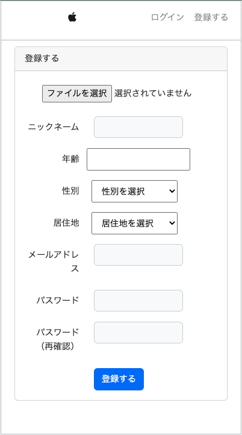

# WEB用マッチングアプリ
webアプリ制作の勉強としてLaravelを用いたマッチングアプリを作成いたしました。
下記に詳細を記載いたします。

## 概要
PHPのフレームワークLaravelを活用したwebマッチングアプリ。
基本となるログイン・新規登録機能、スワイプやマッチング、チャット機能を備える。
最終的には身内だけでも使っていただき、反応やフィードバックをもらいたいと考えている。

## 使い方
### 新規登録

上から順に、顔写真・ニックネーム・年齢・性別・居住地・メールアドレス・パスワードを入力できるようになっている。
スワイプ画面では性別の異なるアカウントのみを表示させるようにしております。

### ログイン

メールアドレスとパスワードにてログインをする。
ログイン状態を記憶する場合は下のチェックボックスにチェックを入れた状態でログインを行う。
パスワード忘れた際のリセット処理も可能。記入されたメールアドレスにて設定する。

### パスワードリセット画面

ログイン時にパスワードを忘れた際に使用。
指定の欄にメールアドレスを記入し提出することで、リセットのためのURLを送付する。

### スワイプ画面

メインとなる画面。中央には登録した顔写真とニックネームを表示。
下部にはYES/NOのボタンを表示。互いにYESを行うことでマッチングする。
上部左側にはログアウト、中央にはスワイプ画面への遷移、右上にはチャット画面への移動のためのアイコンを表示。

### ※スワイプ可能なユーザがいない時

スワイプをし切った際などに表示。

### チャット一覧

マッチした人のみこの画面にて表示。
クリックすることでチャット画面に遷移する。

### チャット画面

どちらのユーザがいつどのような内容を投稿したか表示。
ポイントとして、投稿直後に非同期通信で自動的に内容が表示されるよう工夫した。

### ログアウト

スワイプ画面の左上のアイコンにてログアウトが可能。
ログイン画面に遷移する。

## 環境
macOS Ventura13.3.1
MAMP 6.6
PHP 7.4.21
Laravel Framework 8.83.25

## 力を入れたところ
- データベースを複数組み合わせてリレーションを行ったこと。（1対多）
- チャット直後に自動的に内容が反映されるようにした。
- 基本だが、性別ごとにユーザを表示させた。

## これからについて
- マッチ時のアニメーションを追加
- チャット画面のUIを向上
- モバイル版を作成
